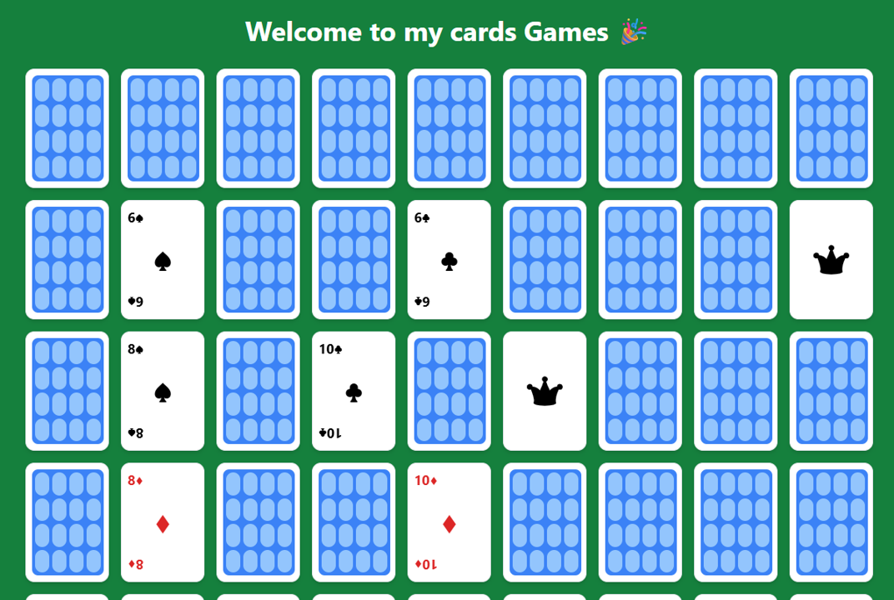

# 🎴 FlipGame

A simple memory card-flipping game built with **Vue 3** and **Nuxt 3**, styled with **Tailwind CSS**. The goal of the game is to match pairs of cards (ranks and suits) while tracking flips.  

## 🚀 Features  
- 🃏 Multiple difficulty levels (2x2, 4x4, 6x6, Full deck).  
- 🎉 Celebration modal with confetti animation when you win.  
- 🔄 Card flip animations.  
- 📱 Responsive design with Tailwind CSS.  
- ⚡ Built with Vue 3’s `ref`, `computed`, and component communication.  
- 🗂️ State management via [Pinia](https://pinia.vuejs.org/) (tracks win state).  

## 🛠️ Tech Stack  
- [Nuxt 3](https://nuxt.com/) (Vue 3 framework)  
- [Pinia](https://pinia.vuejs.org/) (state management)  
- [Tailwind CSS](https://tailwindcss.com/) (styling)  
- [canvas-confetti](https://www.npmjs.com/package/canvas-confetti) (celebration animation)  

## 📦 Installation  

Clone the repo:  
```bash
git clone https://github.com/your-username/flipgame.git
cd flipgame
```

Install dependencies (with pnpm, npm, or yarn):  
```bash
pnpm install
# or
npm install
# or
yarn install
```

Start development server:  
```bash
pnpm dev
# or
npm run dev
# or
yarn dev
```

Build for production:  
```bash
pnpm build
```

Preview production build:  
```bash
pnpm preview
```

## 🎮 How to Play  
1. Select a difficulty level (Easy, Normal, Hard, Hell).  
2. Start the game.  
3. Flip two cards at a time.  
   - If they match → they stay flipped.  
   - If not → they flip back after a short delay.  
4. Keep going until all pairs are matched.  
5. 🎉 When you win → enjoy the confetti celebration!  

## 📂 Project Structure  
```
flipgame/
 ├─ components/
 │   ├─ card.vue        # Single card component
 │   ├─ cardBack.vue    # Single card back component
 │   ├─ cardFront.vue   # Single card front component
 │   ├─ cards.vue       # place all cards component
 │   └─ winning.vue     # Win modal + confetti
 ├─ pages/
 │   └─ index.vue       # Main game page
 ├─ store/
 │   └─ checkWinner.ts  # Pinia store for isWin state
 ├─ public/
 ├─ README.md
 ├─ package.json
 └─ nuxt.config.ts
```

## 📸 Screenshots  
)
)

## ✨ Future Improvements  
- Add timer and move counter.  
- Implement score tracking and leaderboard.  
- Add sound effects.
- Multiplayer mode?  

## 📜 License  
MIT License © 2025 Tom Che
